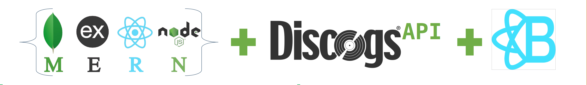
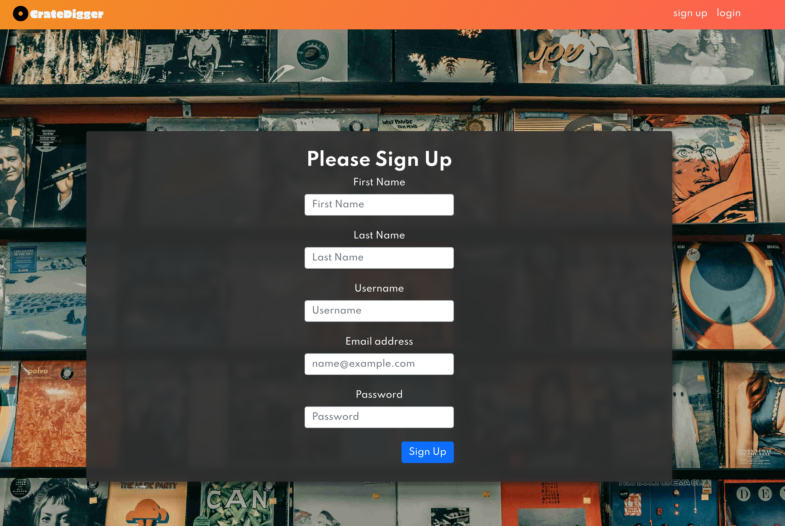
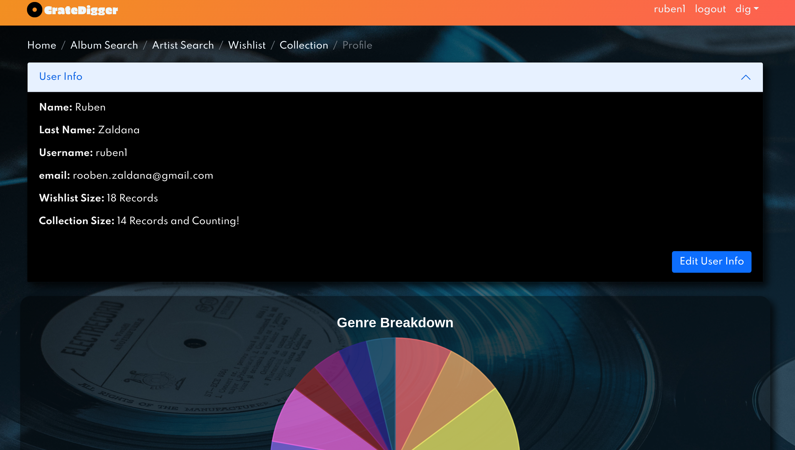

# **CrateDigger**

**Problem:**

I seem to find record shops when I least expect it, and I’m never prepared for it. I can’t seem to keep track of what is in my current collection and I cant remember what releases I want to pick up. I sometimes avoid going into shops because I don’t have enough time to dig through all the crates to refresh my memory. If only I had some kind of collection database with a wish list feature that I could access from anywhere. 

**Solution:**

Step 1: Build Crate Digger.

Step 2: Go buy records. 

 

# **Technology Stack**
 

 
 

## **Back-End**
Back-End Repo:
https://github.com/Zaldana/backend-crate-digger

**MongoDB + Node.js + Express**

The site has three collections that stores the users information, the main vinyl collection, and a wish-list collection. The data models for the vinyl and wish-list collections are comprised of 12 different fields, 11 are used to store the incoming information from the Discogs api request from the front end and the final links the album to the user. The user is authenticated with JWT-Passport an authenticating middleware that extracts a JSON web token which is created in the sign-in response.  Validation for the user is handled through validation middleware that uses the validator library.

**Discogs API**

Discogs  is a digital marketplace for users from around the world to buy and sell music in physical formats. The site has a rich music database and gives users the ability to catalog their collections.  Discogs provides acces to their API for developers looking to make  projects using their database. Crate Digger utilizes the Discogs Api to find vinyl record specific releases. 

 

## **Front-End**

**React + React-Bootstrap**

Crate Digger is designed to focus the abilities of the Discogs API to vinyl specific releases, and allow a curation of the user’s personal library, and to help make quick purchasing decisions. A mobile and full browser work flow are both necessary to achieve the goals of the site. With that in mind the front-end is styled with React-Bootstrap, Chart.js library to visualize user data, and React-Toastify for alerts.

 

 

### **Crate Digger is organized into 11 different pages:**
 

**Unprotected Home:** Landing page with log-in & sign-up buttons.

**Log-in/Sign-Up Pages:** Set up with custom hooks for validation and toast alerts.

**Protected Home:** Home page once user is signed in, sets up navigation to other pages. 

**Album Search:** Allows user to serach via album name and allows the user to add album to wishlist, collection or see album in detail view.

**Artist Search:** Allows user to serach via artist name and allows the user to add album to their wishlist, collection or see album in detail view.

**Wish-list:** Grid view of user's wishlist. 

**Collection:** Grid view of user's collection. 

**Album Details:** Detailed view of album. The detailed view changes based on context. The detailed view from the collection page allows the user to edit album details.

**Profile:**  Page where the user can change account settings and also view graphical representation of their collection.

**Mobile:** All pages are optimized for mobile view.

 

# **Improvements Needed**

Pagination

Results Filtering

Dynamic Search List 

Album Search

Fuzzy Search

Consolidation of Pages

Home Page Features

Expanded Edit Options

Expanded User Statistics

Code Re-factor For Modularity

Styles Consolidation

Accessibility Improvements

Better Album Notes